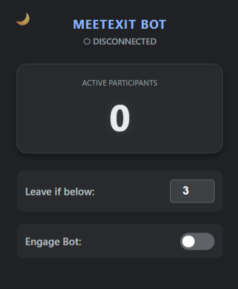

# 🤖 MeetExit Bot

**Never be the last one hanging up.** *An automated "Co-Pilot" for Google Meet that monitors participant counts and hangs up for you.*

## 📖 Overview

Have you ever zoned out during a meeting, only to realize 10 minutes later that you’re the only one left? 

**MeetExit Bot** is a browser extension built to handle your exit strategy. It monitors the real-time participant count of your Google Meet and automatically clicks the "Leave Call" button when the number of people drops below your chosen limit.

## ✨ Key Features

* **⚡ Engage Bot (Auto-Pilot):** A master toggle to arm the system for automatic exit.
* **👁️ Live HUD:** A real-time "Head-Up Display" in the popup showing the exact participant count.
* **🎨 Theme Engine:** Switch between a Dark Mode and an Light Mode.
* **🚦 Visual Intelligence:**
    * **Green Pulse:** Safe zone (meeting is active).
    * **Red Pulse:** Danger zone (you are about to auto-leave).
    * **Neutral Grey:** Disconnected or idle status.
* **📱 Responsive Support:** Custom logic to find participant counts even in mobile-responsive or tiled layouts.

---

## 🚀 Installation Guide

Install the extension manually in **Brave**, **Chrome**, or any Chromium-based browser:

1. **Download** this repository: 
  
2.  Open your browser and navigate to the **Extensions** page (`brave://extensions` or `chrome://extensions`).
3.  Enable **Developer Mode** (top-right toggle).
4.  Click **Load Unpacked**.
5.  Select the folder containing these files.
6.  Open Google Meet and "Engage" your new bot!

---

## 📸 Interface Preview

| Dark Mode (Active) |
|:---:|
|  |
---

## 📄 License

Distributed under the MIT License.
